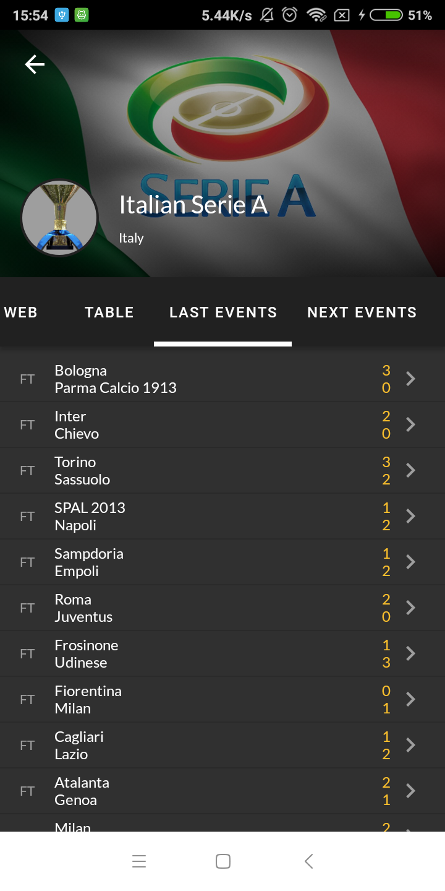
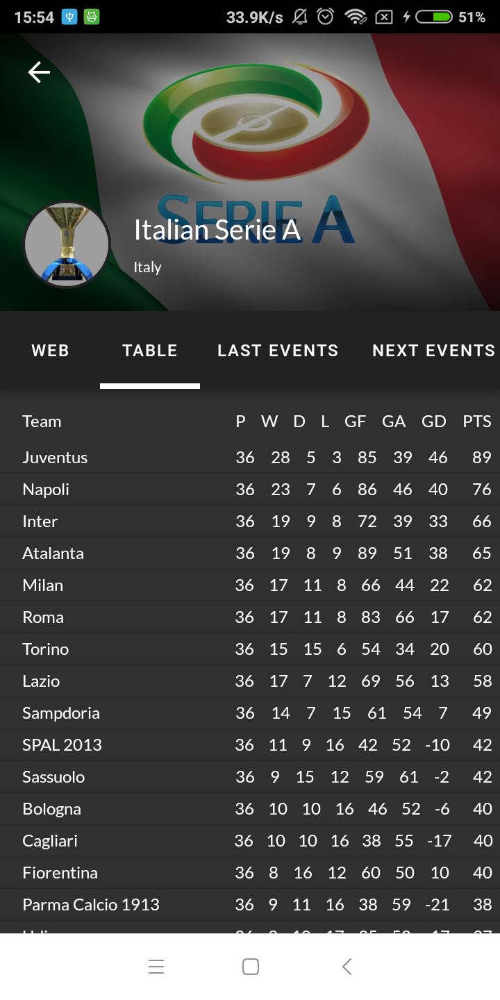
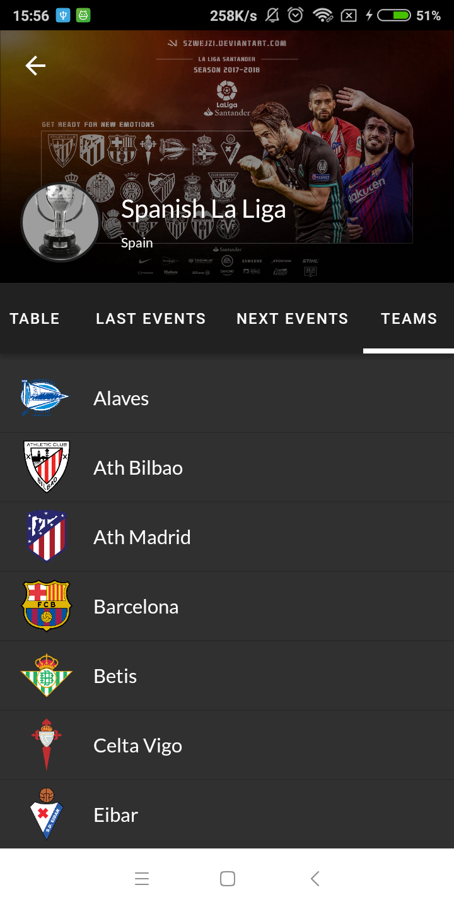
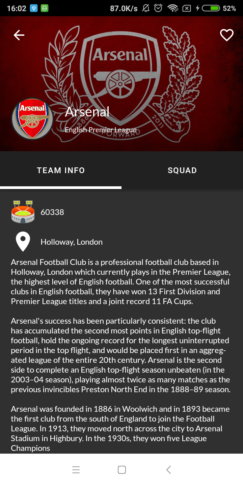
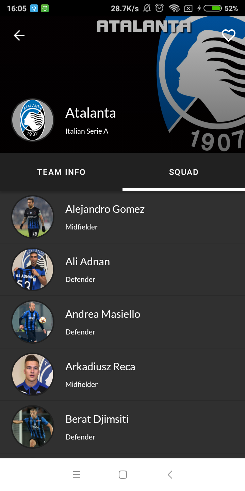
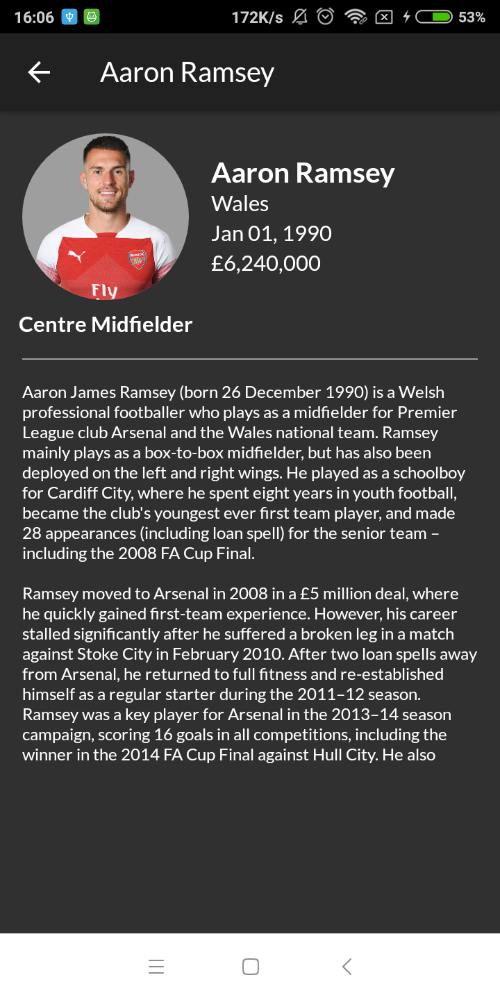
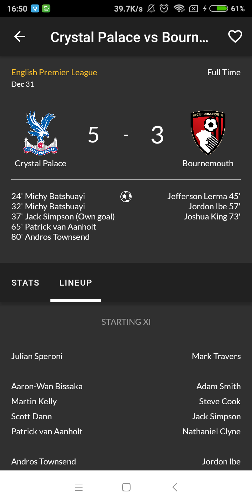

# Calcio

This project is built with kotlin. All football data are collected from https://www.thesportsdb.com.

I am using MVP architecture to build this app. The Unit Testing is implemented using Mockito and Instrumented Testing make use of Espresso.

## Libs Dependencies
* [Anko] - Using Anko Layout for some Layout and Anko Sqlite for DB.
* [Retrofit] - HTTP client
* [Glide] - Image Loading
* [Calligraphy] - Custom fonts in Android
* [Stetho] - Inspect DB
* [Circle Image View] - Custom Image View
* [Mockito] - Mockito for Unit Testing
* [Espresso] - Espresso for Instrumented Testing

## Screenshot

## Repository Created & Maintained By

### Fikri Razzaq

#Flutter Enthusiast, #Android Developer.

[Calligraphy]: <https://github.com/InflationX/Calligraphy>
[Glide]: <https://github.com/bumptech/glide>
[Anko]: <https://github.com/Kotlin/anko>
[Retrofit]: <https://square.github.io/retrofit/>
[Stetho]: <http://facebook.github.io/stetho/>
[Circle Image View]: <https://github.com/hdodenhof/CircleImageView>
[Mockito]: <https://site.mockito.org/>
[Espresso]: <https://developer.android.com/training/testing/espresso>

